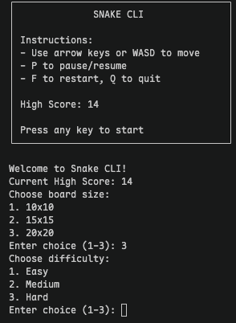
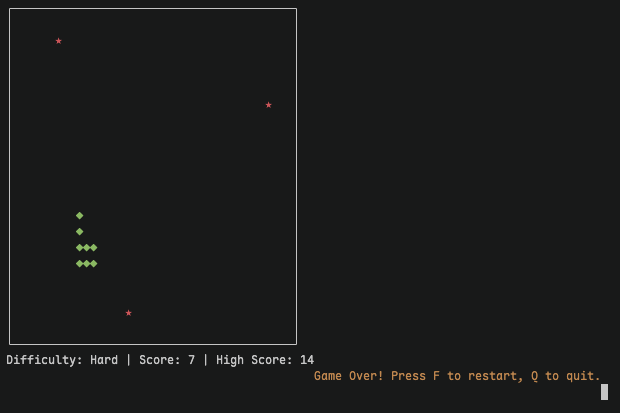

# Snake CLI





A terminal-based Snake game written in Go. Pick board size and difficulty, then play.

## Download (binaries)

Pre-built binaries for players (no Go / IDE required) are published on GitHub Releases:

- [Download for macOS (Apple Silicon)](https://github.com/VinciCantCode/snake-cli/releases/latest/download/snake-cli-macos-arm64)
- [Download for macOS (Intel)](https://github.com/VinciCantCode/snake-cli/releases/latest/download/snake-cli-macos-amd64)
- [Download for Linux (x86_64)](https://github.com/VinciCantCode/snake-cli/releases/latest/download/snake-cli-linux-amd64)
- [Download for Windows (x86_64)](https://github.com/VinciCantCode/snake-cli/releases/latest/download/snake-cli-windows-amd64.exe)

## Features

- **Board sizes**: 10×10, 15×15, or 20×20
- **Difficulty levels**: Easy, Medium, Hard (different speed and number of food on screen)
- **High score**: Saved automatically to `highscore.txt`
- **Pause & restart**: Pause during play; restart or quit after game over

## Requirements

- Go 1.21+
- A Unix-like terminal (macOS, Linux). Uses raw terminal mode (`syscall.Termios`), so native Windows terminals are not supported—use WSL or Git Bash on Windows.

## Install & Run

```bash
# Clone the repo
git clone https://github.com/VinciCantCode/snake-cli.git
cd snake-cli

# Run directly
go run main.go

# Or build then run
go build -o snake-cli
./snake-cli
```

## Controls

| Action      | Keys                  |
|------------|------------------------|
| Move       | Arrow keys or **W A S D** |
| Pause      | **P**                  |
| Restart    | **F** (after game over) |
| Quit       | **Q** (after game over) |

## Game Options

- **Board size**: Choose 1–3 at start for 10×10, 15×15, or 20×20
- **Difficulty**:
  - **Easy**: Slower speed, 1 food on screen
  - **Medium**: Medium speed, 2 food
  - **Hard**: Faster speed, 3 food

## Display

- Snake: green `◆`
- Food: red `★`
- Bottom line shows current difficulty, score, and high score

## High Score

The high score is stored in `highscore.txt` in the project directory and is loaded on startup and shown on the title screen and in-game.

## License

MIT
